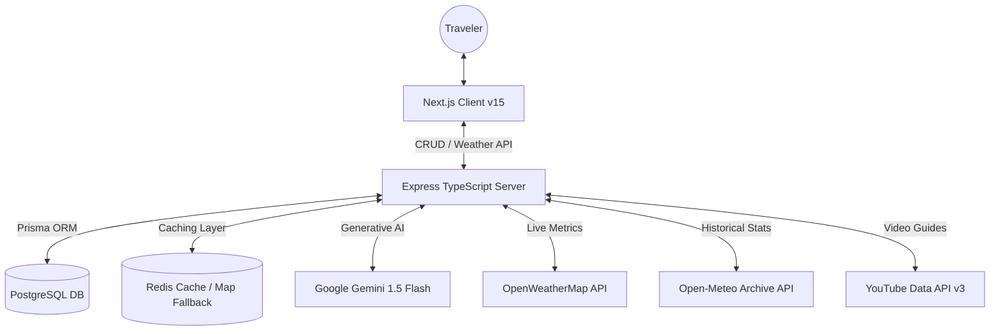

# 🌤️ WeatherMind AI - Intelligent Travel Intelligence Platform

WeatherMind is a premium, full-stack, AI-powered travel forecasting and weather intelligence platform. Transitioned from static designs to a fully secure, database-backed, cached client-server system, WeatherMind analyzes local weather metrics, computes historical anomalies, recommends personalized packing lists, and advises on health precautions.

---

## 🚀 Key Features

*   **Google Gemini AI Layer**: Analyzes live meteorological forecasts to narrative weather patterns, curate packing requirements, and suggest health guidelines using `gemini-1.5-flash`.
*   **5-Year Historical Weather Anomaly Alerts**: Integrates the Open-Meteo Archive API to compare upcoming 5-day forecasts against the last 5 years of daily averages for that exact calendar week, alerting travelers to unusual precipitation or temperature trends.
*   **Persistent Trip Management**: Features a complete Postgres-backed CRUD interface (Add, Edit, and Delete) synced via Prisma ORM.
*   **Sub-100ms Response Caching**: Optimizes load times and guards API rates using a local Redis cache, falling back gracefully to in-memory caching and local storage if services are offline.
*   **Premium Interactive UI**: Crafted with React 19, Next.js 15, and Tailwind CSS v4, featuring glassmorphism, weather animations, responsive overlays, and full CSV/JSON travel itinerary exports.

---

## 🏗️ Architecture



---

## 🛠️ Tech Stack

*   **Frontend**: React 19, Next.js 15, TypeScript, Tailwind CSS v4.
*   **Backend**: Node.js, Express, TypeScript, CORS, Axios.
*   **Database & Cache**: PostgreSQL, Prisma ORM, Redis.
*   **Integrations**: Google Generative AI SDK (Gemini API), OpenWeatherMap API, Open-Meteo Historical API, YouTube Data API.

---

## ⚡ Setup & Installation

### Prerequisite: Launch Databases
Spin up local instances of PostgreSQL and Redis in one click using Docker:
```bash
docker-compose up -d
```

### 1. Configure the Backend
1. Navigate to the `backend/` directory:
   ```bash
   cd backend
   ```
2. Create your `.env` file from the template:
   ```bash
   cp .env.example .env
   ```
3. Set your API credentials (`GEMINI_API_KEY`, `OPENWEATHERMAP_API_KEY`, and optional `YOUTUBE_API_KEY`).
4. Install dependencies and run Prisma database migrations:
   ```bash
   npm install
   npm run prisma:migrate
   ```
5. Start the backend development server:
   ```bash
   npm run dev
   ```
   *Backend will run at `http://localhost:5000`.*

### 2. Configure the Frontend
1. Open a new terminal in the project root.
2. Install dependencies:
   ```bash
   npm install
   ```
3. Launch the Next.js development server:
   ```bash
   npm run dev
   ```
   *Frontend will run at `http://localhost:3000`.*

---

## 📄 License & Credits
Developed by Guna Teja. Designed as an intelligent full-stack meteorological forecasting tool for modern global travelers.
